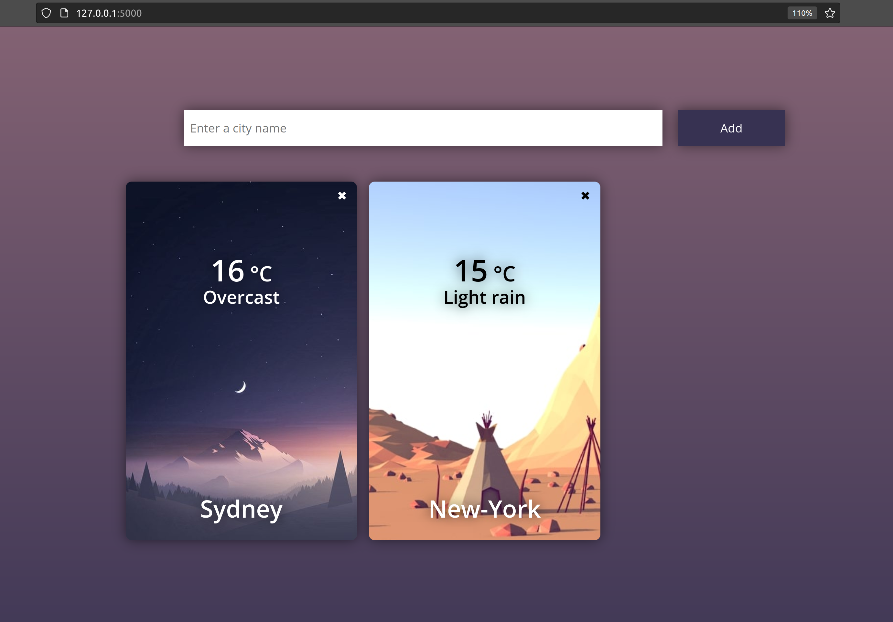

# Weather-app

Hyperskill (Jet Brains Academy) project: a web page that shows weather for chosen cities (Flask).

Python code and html are mine, skin and css are from Jet Brains Academy.


The main idea is to show weather for chosen cities on the browser page with skins corresponding the time of the day. The weather is requested from weather API ( I used weatherapi.com).

! 
### To start Server

1. Clone the project with ```git@github.com:ValeriiaPavl/weather-app.git```.
2. Install all the dependencies with the command ```pip install -r requirements.txt```.
3. Go to the weatherapi.com, register there and get api key (it's free).
4. Create the .env file and paste your api key there.
5. After that you can run the server with the command ```python -m flask run``` in the folder where the app.py file
   located.

### What I've learned:

While doing the project I got acquainted with Flask, SQLAlchemy with SQLite, requests and Jinja template language
operations.
